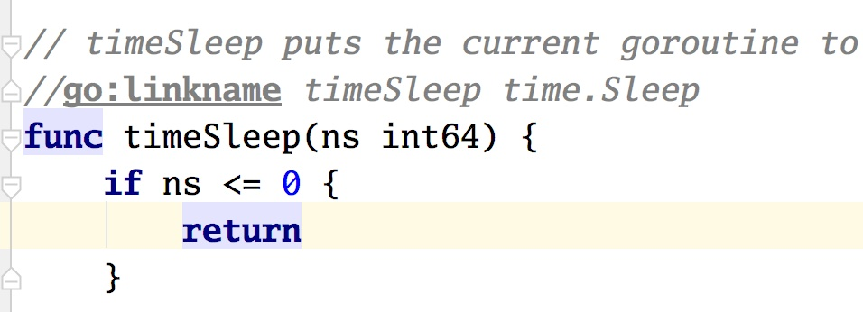
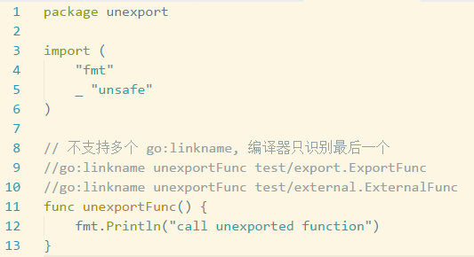
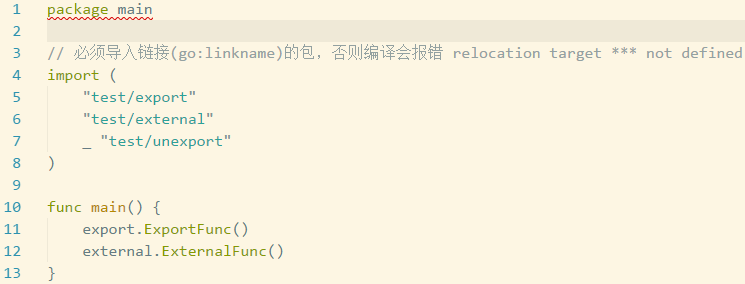
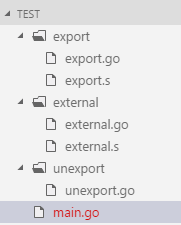

## 20180510 线下活动

*Go 标准包阅读*

Go 版本：go 1.10.1

### strings

- strings.go（进度50%）

### 问题清单

以下是我们在阅读过程中的一些问题，希望可以引起大家的关注，也欢迎大家提出自己的理解，最好可以给以文章总结。

重头戏：**Rabin-Karp search**

Rabin-Karp 算法的思想：

1. 假设待匹配字符串的长度为M，目标字符串的长度为N（N>M）；
2. 首先计算待匹配字符串的hash值，计算目标字符串前M个字符的hash值；
3. 比较前面计算的两个hash值，比较次数N-M+1：
	- 若hash值不相等，则继续计算目标字符串的下一个长度为M的字符子串的hash值
	- 若hash值相同，则需要使用朴素算法再次判断是否为相同的字串

- 16777619 为什么是这个值？ RK, FNV 算法
	16777619 = (2^24 + 403))
- len 计算问题？是否是每次都会计算，直接拿值，不需要单独计算的；
- len 与 runtime 包里面的某些实现的有何区别？

func IndexByte(s string, c byte) int // ../runtime/asm_$GOARCH.s）

- strings.s

\# strings.s

```
// Copyright 2013 The Go Authors. All rights reserved.
// Use of this source code is governed by a BSD-style
// license that can be found in the LICENSE file.

// This file is here just to make the go tool happy.
```
`*.s` 文件存在的原因是 Go 在编译的时候会启用 -compile 编译器 flag ，它要求所有的函数必须包含函数体，创建一个空的汇编语言文件绕开这个限制。

- go:linkname 

>控制谁可以调用它。

Go 的隐藏功能

```
//go:noescape
//go:noinline
//go:nosplit
//go:linkname
...

其它
// +build
//go:generate
package xxx // import "xxx"
//line
```

其中有一些 net_linux.go 或 asm_amd64.s，Go 语言的构建工具将只在对应的平台编译这些文件。
如果在包中加入 // +build linux darwin 表示该包只在 linux 和 mac 下被编译。
而 // +build ignore 是忽略该包。

它跟 internal 有什么不同呢？

>一个internal包只能被和internal目录有同一个父目录的包所导入。

举例说明：


time.Sleep()的实现函数在runtime包的time.go
...

其他更多的使用，大家可以自行搜索 `go:linkname`










- (i+16)/8 这个16，8是什么意思？怎么解读这个逻辑的呢？

```go
// Switch to indexShortStr when IndexByte produces too many false positives.
// Too many means more that 1 error per 8 characters.
// Allow some errors in the beginning.
if fails > (i+16)/8 {
	r := indexShortStr(s[i:], substr)
	if r >= 0 {
		return r + i
	}
	return -1
}
```

- 逻辑是什么意思呢？

```go
// contains reports whether c is inside the set.
func (as *asciiSet) contains(c byte) bool {
	return (as[c>>5] & (1 << uint(c&31))) != 0
}
```

- makeASCIISet

```go
// ascii空格包括\t,\n,\v,\f,\r, ` ` 
var asciiSpace = [256]uint8{'\t': 1, '\n': 1, '\v': 1, '\f': 1, '\r': 1, ' ': 1}
```

## 参考资料

1. [~~**大家一定要看这一篇文章：Rabin-Karp 算法（字符串快速查找）**~~](http://www.cnblogs.com/golove/p/3234673.html)
2. [primes-16777619](https://primes.utm.edu/curios/page.php/16777619.html)
3. [Fowler–Noll–Vo hash function](https://en.wikipedia.org/wiki/Fowler%E2%80%93Noll%E2%80%93Vo_hash_function)
4. [FNV Hash](http://www.isthe.com/chongo/tech/comp/fnv/index.html)
5. [FNV哈希算法【学习】](http://www.cnblogs.com/baiyan/archive/2011/04/23/2025701.html)
7. [字符串查找算法（二）](http://blog.cyeam.com/golang/2015/01/15/go_index)
8. [突破限制,访问其它Go package中的私有函数](http://colobu.com/2017/05/12/call-private-functions-in-other-packages/)
9. [How to call private functions (bind to hidden symbols) in GoLang](https://sitano.github.io/2016/04/28/golang-private/)
