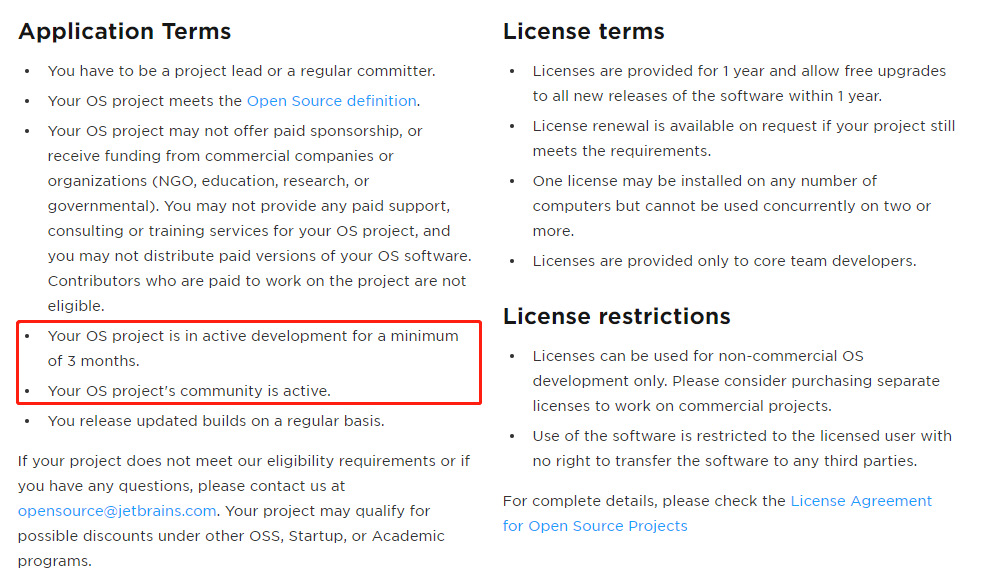

## 2018-05-09

来源：《Go 夜读》微信群
时间：2018-05-09

## 1. debug

调试：dlv

（待补充）

## 2. not reached

*go/src/runtime/panic.go*

（待补充）

## 3. Go 开发工具

- Vim：（待补充）
- Emacs
- VSCode
- JetBrains: IntelliJ,Goland

    - Goland用学生邮箱可以免费
    - 服务器认证（这个就不贴了，大家自行Google）
    - [其他更多](https://www.jetbrains.com/go/buy/#edition=discounts)




- LiteIDE: LiteIDE的跟踪代码很不错,可以同时在一个窗口打开多个项目的目录.

## 4. 问题

```
var x string
func init() {
    x, err := getValue()
}
```

有一个全局变量 x，在 `init()` 函数里面赋值，然后获取 x 的值发现全局变量未赋值，这种情况有什么优雅的解决方法吗？

1. 

```go
var x string
func init() {
    var err error
    x, err = getValue()
}
```

这个:=为什么不能对全局变量起作用呢？因为它成为局部变量了，屏蔽了全局变量作用域。

2. 

<del>

```go
var x string 
func init()(err error) {
    x, err = getValue()
}
```
</del>
这种办法虽然看起来似乎舒服了一点，但是init 函数不能能有返回值

## 参考资料

1. [Go 开发工具](https://github.com/yangwenmai/learning-golang#go-开发工具)